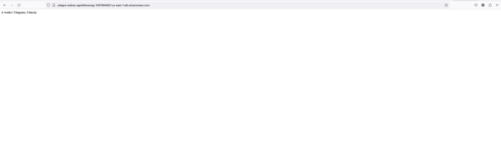

# CD12352 - Infrastructure as Code Project Solution

## Nga Nguyen

Deploy a high availability web app using CloudFormation

## Spin up instructions

1. create stack:

- Network: `$ ./create-stack.sh udagram-server udagram.yml udagram-parameters.json <profile-aws-cli>`
- Server: `$ ./create-stack.sh udagram-network network.yml network-parameters.json <profile-aws-cli>`

2. delete stack:

- Network: `$ ./delete-stack.sh udagram-network <profile-aws-cli>`
- Server: `$ ./delete-stack.sh udagram-server <profile-aws-cli>`

3. Update stack

- Network: `$ ./update-stack udagram-server udagram.yml udagram-parameters.json <profile-aws-cli>`
- Server: `$ ./update-stack udagram-network network.yml network-parameters.json <profile-aws-cli>`

## Working test url

[udagra-WebSe-aGWblBXwsojG-1061994807.us-east-1.elb.amazonaws.com](http://udagra-webse-agwblbxwsojg-1061994807.us-east-1.elb.amazonaws.com/)

